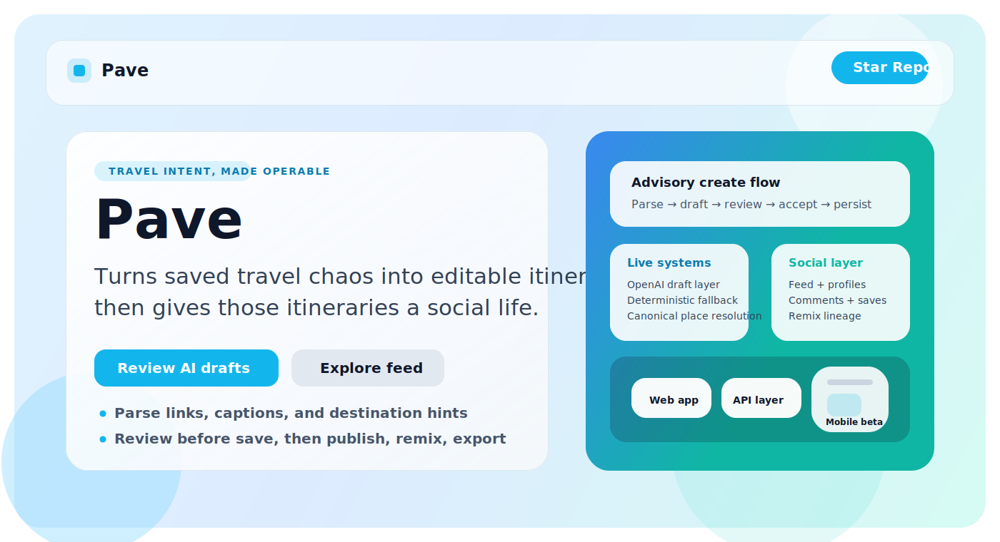
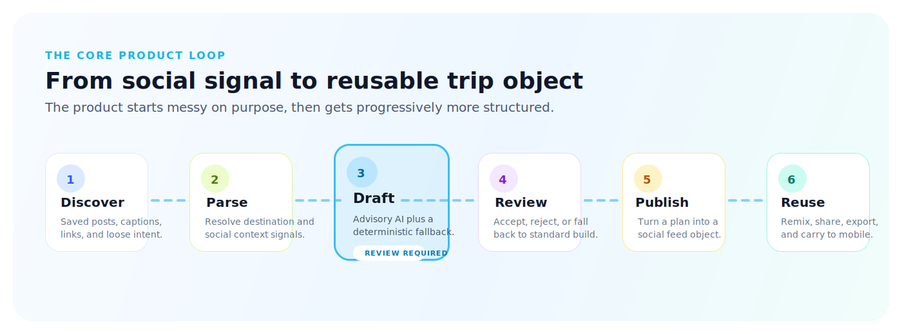
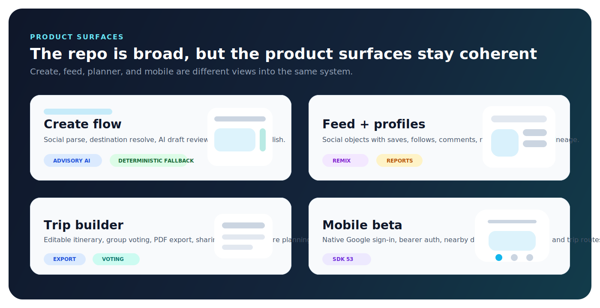
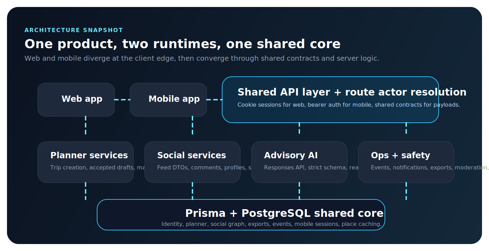
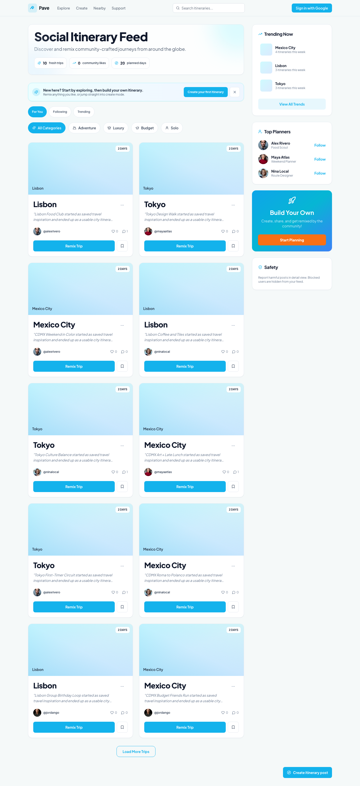
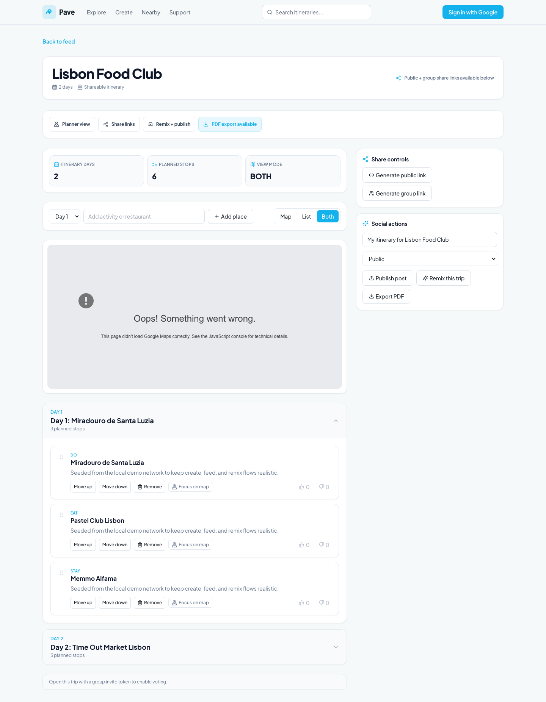
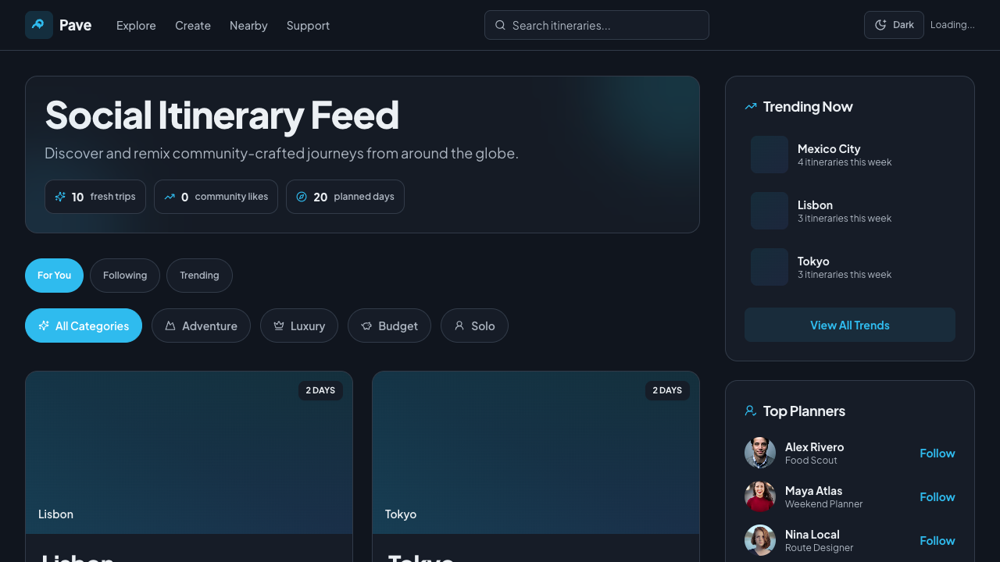
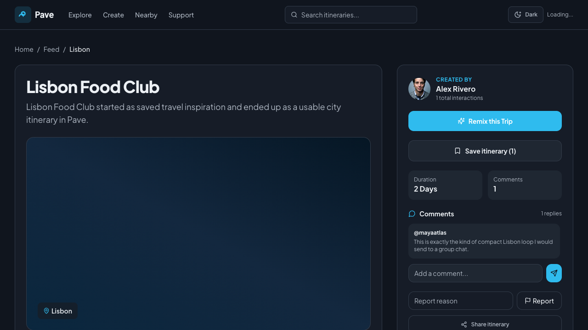
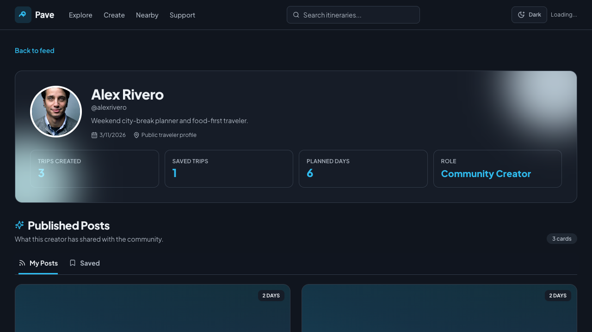

# Pave

[](https://nextjs.org/)
[](https://react.dev/)
[](https://www.typescriptlang.org/)
[](https://www.prisma.io/)
[](https://www.postgresql.org/)
[](https://expo.dev/)
[](https://vitest.dev/)
[](https://nodejs.org/)

<p align="center">
  
</p>

<p align="center">
  <strong>Pave takes the messy “I saved this somewhere” phase of travel planning and turns it into something you can actually operate.</strong>
  <br />
  It parses social travel intent, drafts editable itineraries, publishes them into a social feed, supports remix and collaboration, and carries the same product identity across web and mobile.
</p>

<p align="center">
  <em>This is the real product repo, not a landing-page shell pretending to be one.</em>
</p>

## At a Glance

<p align="center">
  
</p>

<p align="center">
  Pave starts with unstructured travel intent, adds just enough system around it, and ends with a trip object people can actually reuse.
</p>

<p align="center">
  
</p>

<p align="center">
  
</p>

## Fresh Local Screens

These screenshots were captured from the live app against the local Docker-backed database after seeding the demo network. They are not polished mockups. They are the product showing its work.

| Create flow | Nearby discovery |
|---|---|
|  |  |

| Social feed | Trip builder |
|---|---|
|  |  |

## Theme Support

Pave now supports both light and dark mode on the web app.

- the app defaults to the visitor's system theme
- the header toggle lets a user pin light or dark mode manually
- shared semantic tokens drive the shell and major product surfaces, so theme changes stay consistent instead of turning into route-by-route one-offs

The current pass covers the shared shell plus the main planning and social routes: create, feed, post detail, nearby, profile, trip builder, and place hub.

### Dark Mode Snapshots

These are live captures from the seeded app in dark mode.

| Feed | Post detail | Profile |
|---|---|---|
|  |  |  |

## Proprietary Notice

This repository is proprietary. It is **not** open source.

- All rights are reserved.
- No permission is granted to copy, modify, distribute, sublicense, sell, or reuse this codebase without prior written permission.
- See [LICENSE](./LICENSE) for the repository notice currently applied.

## Why Pave Exists

Travel planning usually breaks in one of two places:

- inspiration is everywhere, but hard to turn into a real plan
- planners are useful, but disconnected from how people actually discover trips

Pave is built to close that gap.

The product starts where most people actually start: a caption, a reel, a saved post, a half-formed idea about where they want to go. From there, Pave turns that intent into a practical itinerary and gives it a social life after creation.

## What Lives In This Repo

This repository is the working product codebase for Pave. It is not a brochure repo or a design-only shell.

It includes:

- the **web product** built with Next.js App Router
- the **mobile beta client** built with Expo Router / React Native
- the **shared contracts** package used by both clients
- the **server-side planning, social, moderation, export, and event services**
- the **Prisma schema** for planner, feed, identity, growth, and mobile session models

This repo implements the actual product loops:

1. discover travel inspiration
2. convert that inspiration into a trip
3. publish or remix the trip socially
4. collaborate, export, and share
5. repeat the loop on web and mobile

## Product Summary

Pave sits between travel inspiration products and travel planning products.

Most travel content products help users **find ideas** but stop there.
Most travel planning tools help users **organize trips** but are disconnected from the original social content that created intent.

Pave is the bridge. Not a passive scrapbook. Not a sterile itinerary spreadsheet. A system that turns intent into action.

### Core user loops

1. **Inspiration to itinerary**
   - user pastes caption text and links
   - Pave extracts destination and activity hints
   - user applies preferences like budget, pace, days, and vibe
   - system produces a structured trip

2. **Itinerary to social object**
   - user publishes a trip as a post
   - post appears in the feed with like/save/comment/remix actions
   - profile surfaces show authored and saved content

3. **Community reuse**
   - another user remixes the trip into their own copy
   - trip lineage is preserved
   - engagement and share attribution feed product growth signals

4. **Execution and collaboration**
   - user shares a trip
   - group invite voting collects lightweight feedback
   - user exports PDF for offline or external use

5. **Cross-platform continuity**
   - the same backend powers web and mobile
   - mobile uses bearer-token auth while web uses session cookies
   - shared contracts reduce drift between clients

## Current Product State

Pave currently has two active product surfaces.

### Web

The web app is the primary full-feature surface today.

Implemented flows include:

- landing and create flows
- advisory AI-assisted create flow with review-before-save behavior
- feed browsing and engagement
- post detail and comments
- profile pages with posts and saved items
- nearby discovery
- place hub browse
- trip builder
- share, remix, vote, and PDF export
- reports, moderation, follow, block, and notifications

### Mobile beta

The Expo app is a closed-beta style mobile client with real backend reuse.

Implemented flows include:

- native Google sign-in
- mobile feed tabs
- nearby discovery with device geolocation fallback
- trip detail and mobile PDF export/share
- post detail and comments
- profile views
- place hub and trip routes
- mobile telemetry and device registration

The mobile app is not a separate backend. It intentionally reuses the same core APIs wherever possible.

## Repo Layout

| Path | Purpose |
|---|---|
| `app/` | Next.js App Router pages and API routes |
| `apps/mobile/` | Expo mobile app for the closed-beta client |
| `components/` | Shared web UI components and page clients |
| `lib/server/` | Server-side business logic, auth resolution, feed shaping, exports, moderation, events |
| `packages/contracts/` | Shared TypeScript DTOs used across web and mobile |
| `prisma/` | Prisma schema, migrations, and seeding |
| `scripts/` | contributor bootstrap and combined web/mobile dev helpers |
| `docs/` | PRD, SLOs, contributor guides, mobile runbooks, rollout checklists |
| `tests/` | Vitest unit/integration tests and Playwright e2e tests |
| `public/.well-known/` | deep-link association files for mobile link ownership |

## Architecture Overview

### High-level shape

Pave is organized as a single monorepo with:

- one **web runtime**
- one **mobile runtime**
- one **shared schema**
- one **shared contract layer**

### Request flow

1. A web page or mobile screen issues a request.
2. Next.js route handlers in `app/api/**` receive the request.
3. Route-level auth helpers normalize the caller.
   - web routes typically resolve Auth.js cookie sessions
   - mobile routes resolve bearer tokens and mobile sessions
4. Business logic is executed in `lib/server/**`.
5. Prisma reads/writes PostgreSQL.
6. Side effects such as events, notifications, reports, feed actions, exports, or share attribution are recorded.

### Important service modules

| Module | Responsibility |
|---|---|
| `lib/server/trip-service.ts` | creates trips, retrieves trip details, manages planner behavior |
| `lib/server/ai/*` | OpenAI-backed advisory draft generation, schema guardrails, tool orchestration, retrieval wiring |
| `lib/server/social-service.ts` | shapes posts, profiles, comments, feed DTOs, and post detail payloads |
| `lib/server/feed-ranker.ts` | scores and re-ranks feed candidates with diversity logic |
| `lib/server/events.ts` | event ingestion, action tracking, notification creation |
| `lib/server/moderation.ts` | profanity checks and moderation helpers |
| `lib/server/export-service.ts` | PDF generation and export bookkeeping |
| `lib/server/link-metadata.ts` | URL metadata lookup and destination hint extraction |
| `lib/server/rate-limit.ts` | rate limiting with Upstash support and local fallback |
| `lib/server/route-user.ts` | dual-mode actor resolution for web session and mobile bearer auth |
| `lib/server/mobile-auth-service.ts` | Google token bridge, mobile session issuance, refresh token rotation |

### Shared contracts

`packages/contracts` contains shared DTO definitions.

That package intentionally has no build step right now. The workspace consumes its TypeScript source directly. That keeps iteration fast, but it also means contract changes should be treated as API changes and tested accordingly.

## Product Surfaces

### Web routes

| Route | Purpose |
|---|---|
| `/` | explore-first landing page with parser entry, preference flow, and inspiration surfaces |
| `/create` | build a trip from social context and optionally publish it |
| `/feed` | feed browsing with source modes, pagination, engagement, trending rail, and top planners |
| `/post/[postId]` | post detail, source links, comments, reporting, remix handoff |
| `/profile/[username]` | public profile, posts, saved content, follow/block interactions |
| `/trip/[slug]` | trip builder with sharing, voting, remix, and PDF export |
| `/place/[placeId]` | place hub with Eat/Stay/Do groupings and map/list context |
| `/nearby` | lightweight nearby discovery surface for quick local exploration |
| `/notifications` | activity inbox |
| `/support` | support and trust/safety contact path |
| `/privacy` | current privacy baseline and data-handling boundaries |
| `/terms` | current product terms and platform boundaries |

### Mobile routes

| Route | Purpose |
|---|---|
| `apps/mobile/app/index.tsx` | app boot + auth gate |
| `apps/mobile/app/sign-in.tsx` | native Google sign-in bridge |
| `apps/mobile/app/(tabs)/home.tsx` | nearby discovery with location-aware recommendations |
| `apps/mobile/app/(tabs)/feed.tsx` | mobile feed |
| `apps/mobile/app/(tabs)/create.tsx` | mobile create flow |
| `apps/mobile/app/(tabs)/profile.tsx` | current-user profile entry |
| `apps/mobile/app/post/[postId].tsx` | mobile post detail |
| `apps/mobile/app/trip/[slug].tsx` | mobile trip detail, sharing, voting, PDF export |
| `apps/mobile/app/place/[placeId].tsx` | mobile place hub |
| `apps/mobile/app/profile/[username].tsx` | profile deep-link destination |

### API routes by domain

| Domain | Routes |
|---|---|
| Auth | `/api/auth/[...nextauth]`, `/api/mobile/auth/*`, `/api/mobile/me` |
| AI create | `/api/ai/trips/draft`, `/api/trips/from-draft` |
| Feed | `/api/feed`, `/api/feed/for-you`, `/api/feed/following` |
| Posts | `/api/posts`, `/api/posts/[postId]`, like/save/comment/delete |
| Trips | `/api/trips`, `/api/trips/slug/[slug]`, share, invite, vote, remix, export |
| Discovery | `/api/nearby`, `/api/place/[placeId]`, `/api/places/*`, `/api/search/autocomplete` |
| Parsing | `/api/social/parse`, `/api/links/metadata` |
| Graph / growth | `/api/events/batch`, `/api/shares/track`, follow, block, notifications |
| Safety | `/api/reports`, comment/post delete routes |
| Ops | `/api/health` |

## Data Model Overview

The Prisma schema is grouped around product loops rather than around a generic CRUD admin model.

### Identity and auth

- `User`
- `Account`
- `Session`
- `VerificationToken`
- `AnonymousSession`
- `MobileSession`
- `MobileRefreshToken`
- `Device`

These models allow the web app and mobile app to coexist cleanly:

- web uses Auth.js session mechanics
- mobile uses short-lived access tokens and rotating refresh tokens
- device registration lets beta telemetry and push-oriented identity stay installation-aware

### Trip planning

- `Trip`
- `TripDay`
- `TripItem`
- `GroupInvite`
- `Vote`

These models represent the editable itinerary and the lightweight collaboration surface.

### Social graph and content

- `Post`
- `PostSourceLink`
- `PostLike`
- `PostSave`
- `Comment`
- `Follow`
- `Block`
- `Report`

These models support the public feed, creator profiles, engagement loops, moderation, and block-aware visibility.

### Growth and observability

- `Event`
- `Notification`
- `FeedImpression`
- `FeedAction`
- `ShareAttribution`

These models provide the feedback loop for ranking, notification UX, and growth analytics.

### Reuse and exports

- `TripRemix`
- `TripExport`

These models make remix lineage explicit and track export outcomes rather than treating export as a fire-and-forget side effect.

### Discovery caching

- `PlaceCache`
- `NearbyCache`

These models reduce repeated external lookups and protect latency/quota usage.

## Documentation Index

- Product requirements: [docs/PRD.md](./docs/PRD.md)
- Contributor onboarding: [docs/CONTRIBUTOR_SETUP.md](./docs/CONTRIBUTOR_SETUP.md)
- Repository usage policy: [docs/REPO_POLICY.md](./docs/REPO_POLICY.md)
- Mobile infrastructure: [docs/MOBILE_INFRA.md](./docs/MOBILE_INFRA.md)
- Mobile beta QA: [docs/MOBILE_BETA_QA.md](./docs/MOBILE_BETA_QA.md)
- Reliability baseline: [docs/SLOS_AND_DASHBOARDS.md](./docs/SLOS_AND_DASHBOARDS.md)
- Redesign rollout checklist: [docs/REDESIGN_ROLLOUT_CHECKLIST.md](./docs/REDESIGN_ROLLOUT_CHECKLIST.md)

## Runtime Requirements

### Required versions

- Node.js `22.x`
- pnpm `10.x`

The repo declares those engine versions explicitly. Other Node versions may work, but they are not the supported baseline and may print warnings.

### Local infrastructure

- Docker Desktop is strongly recommended for local PostgreSQL
- Xcode is required for `expo run:ios`
- Android Studio / SDK are required for `expo run:android`

## Quick Start

### Fastest path

From the repository root:

```bash
pnpm setup:contributor
```

Then start the web app:

```bash
pnpm dev
```

Or start web and mobile together:

```bash
pnpm dev:all
```

### What `pnpm setup:contributor` actually does

This is the canonical contributor bootstrap path. It performs several opinionated steps in order:

1. checks that `pnpm` exists
2. checks that `node` exists
3. warns if the current Node major version is not `22`
4. creates `.env` from `.env.example` if missing
5. creates `.env.local` from `.env.example` if missing
6. creates `apps/mobile/.env` from `apps/mobile/.env.example` if missing
7. if Docker is installed, starts the local PostgreSQL container via `docker compose up -d db`
8. waits for PostgreSQL readiness using `pg_isready`
9. installs workspace dependencies with `pnpm install`
10. generates Prisma client
11. attempts `prisma migrate deploy`
12. if the DB already contains unmanaged schema state and Prisma returns `P3005`, it falls back to `prisma db push`
13. seeds the database

That fallback matters. It makes contributor onboarding more resilient against an already-initialized local database, but it also means contributors should still use `pnpm prisma:migrate` when intentionally authoring new schema changes.

## Script Reference

This section is deliberately detailed. The script names alone do not explain the operational nuances.

### Root workspace scripts

| Script | Underlying command | What it does | Nuance |
|---|---|---|---|
| `pnpm dev` | `next dev` | starts the Next.js web dev server | web only; this is the primary local loop for product work |
| `pnpm dev:all` | `bash ./scripts/dev-all.sh` | runs web and mobile dev servers together | if either process exits, the helper kills the other and returns the failing exit code |
| `pnpm build` | `next build` | builds the web app for production | this does not build the Expo mobile app |
| `pnpm start` | `next start` | serves the production web build | requires a completed `pnpm build` |
| `pnpm lint` | `next lint` | runs Next.js linting over the web app | focused on the web codebase, not the mobile workspace |
| `pnpm setup:contributor` | `bash ./scripts/setup-contributor.sh` | bootstraps env files, DB, Prisma client, migrations, and seed data | safest first-run path for contributors |
| `pnpm db:up` | `docker compose up -d db` | starts the local PostgreSQL service | only manages the `db` service, not the full app stack |
| `pnpm db:down` | `docker compose down` | stops the compose stack | tears down the local DB container |
| `pnpm db:logs` | `docker compose logs -f db` | tails PostgreSQL logs | useful for `P1001` / readiness debugging |
| `pnpm mobile:dev` | `pnpm --filter @pave/mobile dev` | starts the Expo development server | mobile only; no web process is started |
| `pnpm mobile:ios` | `pnpm --filter @pave/mobile ios` | runs the native iOS app via Expo prebuild/run | requires Xcode toolchain; heavier than `expo start` |
| `pnpm mobile:android` | `pnpm --filter @pave/mobile android` | runs the native Android app via Expo prebuild/run | requires Android SDK/emulator setup |
| `pnpm mobile:typecheck` | `pnpm --filter @pave/mobile typecheck` | TypeScript check for the mobile workspace | useful before pushing mobile changes even if web is untouched |
| `pnpm mobile:lint` | `pnpm --filter @pave/mobile lint` | ESLint for the mobile workspace | separate from root `pnpm lint` |
| `pnpm ai:sync-knowledge` | `tsx scripts/ai/sync-knowledge.ts` | uploads curated markdown knowledge docs into the configured OpenAI vector store | requires `OPENAI_API_KEY` and `OPENAI_VECTOR_STORE_ID`; does not create the vector store for you |
| `pnpm prisma:generate` | `prisma generate` | generates the Prisma client from the current schema | should be rerun after schema changes or dependency resets |
| `pnpm prisma:migrate` | `prisma migrate dev` | authors and applies a local development migration | use this when intentionally evolving the schema |
| `pnpm prisma:seed` | `prisma db seed` | seeds local data using `tsx prisma/seed.ts` | assumes the target DB is reachable |
| `pnpm test` | `vitest run` | runs the Node-based automated test suite | covers unit and integration-style logic tests in `tests/**/*.test.ts` |
| `pnpm test:watch` | `vitest` | watch mode for Vitest | best for active TDD loops |
| `pnpm test:e2e` | `playwright test` | runs Playwright end-to-end tests | by default spins up a dedicated web server at `127.0.0.1:3100` and waits for `/feed` |
| `pnpm test:e2e:headed` | `playwright test --headed` | headed Playwright run for debugging UI flows | useful for visual debugging or flaky test investigation |

### Helper shell scripts

#### `scripts/setup-contributor.sh`

This script exists because a plain `pnpm install` is not enough to make the repo runnable.

Important behaviors:

- it is safe against missing env files
- it handles Docker-backed local Postgres automatically when Docker is available
- it uses `prisma migrate deploy` during bootstrap instead of `migrate dev`
- it contains a pragmatic fallback to `prisma db push` for already-populated local databases

That last behavior is contributor-friendly but should not be confused with production migration policy.

#### `scripts/dev-all.sh`

This script coordinates the two live runtimes:

- web via `pnpm dev`
- mobile via `pnpm mobile:dev`

It captures both process IDs, watches them in a loop, and performs cleanup on `EXIT`, `INT`, or `TERM`.

Why that matters:

- if the web process crashes, the mobile process does not continue orphaned
- if the mobile process exits, the web process is stopped too
- the script returns the exit code from the process that died first

This is a developer convenience script, not a production process manager.

### Mobile workspace scripts

The mobile workspace lives at `apps/mobile`.

| Script | Underlying command | What it does | Nuance |
|---|---|---|---|
| `pnpm --filter @pave/mobile dev` | `expo start` | launches Expo dev tooling | fastest iteration mode for mobile UI/API work |
| `pnpm --filter @pave/mobile ios` | `expo run:ios` | builds/runs a native iOS shell | more realistic than Expo Go style iteration, but slower |
| `pnpm --filter @pave/mobile android` | `expo run:android` | builds/runs a native Android shell | same tradeoff as iOS |
| `pnpm --filter @pave/mobile lint` | `eslint .` | lints the mobile workspace | catches RN-specific issues separate from Next linting |
| `pnpm --filter @pave/mobile typecheck` | `tsc --noEmit` | validates mobile TS types only | should be run before any mobile commit |

### Contracts workspace

`packages/contracts` does not currently define its own scripts.

That is intentional. It is a lightweight shared package of DTOs and types, consumed directly by the web and mobile workspaces through pnpm workspace linking.

## Environment and Config Files

Pave uses multiple env files on purpose.

### Root env files

| File | Purpose |
|---|---|
| `.env` | baseline local env file |
| `.env.local` | local overrides for the web app |
| `.env.example` | canonical template for root runtime values |

### Mobile env files

| File | Purpose |
|---|---|
| `apps/mobile/.env` | Expo public mobile env values |
| `apps/mobile/.env.example` | mobile template for local Expo config |
| `apps/mobile/.env.sentry-build-plugin` | non-public Sentry build-time values for source map upload |
| `apps/mobile/.env.sentry-build-plugin.example` | template for that build-time Sentry file |

### Root environment variables

| Variable | Meaning | Used by |
|---|---|---|
| `DATABASE_URL` | PostgreSQL connection string | Prisma, all server-side data access |
| `GOOGLE_MAPS_API_KEY_PUBLIC` | browser-safe Maps JS key | web map surfaces |
| `GOOGLE_MAPS_API_KEY_SERVER` | server-side Places key | nearby, place details, autocomplete, metadata-enriched place workflows |
| `NEXT_PUBLIC_APP_URL` | canonical client URL | web URL generation |
| `NEXTAUTH_URL` | Auth.js callback base | web auth/session correctness |
| `RATE_LIMIT_WINDOW_MS` | rate-limit window size | route throttling |
| `RATE_LIMIT_MAX_REQUESTS` | max allowed requests per window | route throttling |
| `UPSTASH_REDIS_REST_URL` | distributed rate-limit backend URL | shared rate limiting when configured |
| `UPSTASH_REDIS_REST_TOKEN` | distributed rate-limit backend token | shared rate limiting when configured |
| `SUPPORT_EMAIL` | support contact destination | support and trust-safety messaging |
| `DEEP_LINK_BASE_URL` | canonical deep-link ownership base | mobile link routing and association files |
| `NEXTAUTH_SECRET` | Auth.js secret | web session/token integrity |
| `GOOGLE_CLIENT_ID` | Google OAuth client id for web | Auth.js Google provider |
| `GOOGLE_CLIENT_SECRET` | Google OAuth secret for web | Auth.js Google provider |
| `GOOGLE_IOS_CLIENT_ID` | Google native client for iOS validation | mobile auth bridge |
| `GOOGLE_ANDROID_CLIENT_ID` | Google native client for Android validation | mobile auth bridge |
| `MOBILE_AUTH_JWT_SECRET` | signing secret for mobile access tokens | mobile bearer auth |
| `MOBILE_ACCESS_TOKEN_TTL_MINUTES` | mobile access token lifetime | mobile auth session tuning |
| `MOBILE_REFRESH_TOKEN_TTL_DAYS` | mobile refresh token lifetime | mobile auth session tuning |
| `OPENAI_API_KEY` | server-side OpenAI credential for advisory itinerary drafting | `/api/ai/trips/draft`, knowledge sync |
| `OPENAI_RESPONSES_MODEL` | model name used for the AI create flow | OpenAI Responses API calls |
| `OPENAI_VECTOR_STORE_ID` | vector store id for curated planning docs | OpenAI file search tool |
| `ENABLE_AI_CREATE` | server-side gate for AI create behavior | AI draft route |
| `NEXT_PUBLIC_ENABLE_AI_CREATE` | client-side gate for showing the AI drafting path | `/create` UI |
| `USE_MOCK_PLACES_PROVIDER` | explicit local-only switch for mock place data | local demos, tests, provider fallback drills |

### Runtime readiness and degraded mode

Pave now exposes `GET /api/health` as a lightweight readiness route.

It reports:
- app version
- environment
- database connectivity
- subsystem readiness booleans for auth, maps, AI create, mobile telemetry, and rate limiting

It does **not** expose secret values.

This route is intentionally honest about optional integrations. Database and auth are treated as the core readiness baseline, while maps, AI create, and mobile telemetry can show as degraded without crashing unrelated product surfaces.

## AI Create Flow

The web create surface now has two generation modes:

1. **Pave AI draft**
   - advisory only
   - parses social context and preferences
   - resolves the destination place
   - calls the OpenAI Responses API with:
     - strict JSON schema output
     - read-only live-data tools
     - optional file-search retrieval over curated internal docs
   - returns a draft for user review
   - does not persist anything until the user explicitly accepts the draft

2. **Standard generator**
   - existing deterministic itinerary path
   - still available as the fallback and as a direct non-AI option

### AI route contract

- `POST /api/ai/trips/draft`
  - input: caption, links, selected destination place, normalized preferences
  - output: structured advisory draft plus `generationMode` of `ai` or `fallback`

- `POST /api/trips/from-draft`
  - input: accepted draft plus preferences
  - output: persisted trip using canonical place resolution for every draft item

### Guardrails

- drafts are limited to 1 to 3 days
- every item must be backed by a real `placeId`
- duplicate place ids are rejected
- at most one `stay` item is allowed
- invalid model output falls back to the deterministic draft path instead of hard-failing the user flow

### Knowledge sync workflow

Curated retrieval documents live in [docs/ai-knowledge](./docs/ai-knowledge).

To sync them into the configured OpenAI vector store:

```bash
pnpm ai:sync-knowledge
```

Required env vars:

```bash
OPENAI_API_KEY=...
OPENAI_VECTOR_STORE_ID=...
```

This script uploads each markdown file and attaches it to the specified vector store. It assumes the vector store already exists.

### Current local status

The AI create code path is implemented and validated at build/test level, but a **real live smoke test requires valid provider secrets**:

- `OPENAI_API_KEY`
- `OPENAI_VECTOR_STORE_ID`
- `GOOGLE_MAPS_API_KEY_SERVER`

Without those values, the app can still compile and the AI route can safely degrade to fallback behavior, but the true parse -> draft -> accept -> publish loop cannot be verified against live providers.

## What’s Actually Interesting Here

If you are scanning this repo to figure out whether it is real, these are the parts worth opening first:

- [components/create-itinerary-form.tsx](./components/create-itinerary-form.tsx) for the social-input-to-trip flow
- [lib/server/trip-service.ts](./lib/server/trip-service.ts) for planner generation and accepted-draft persistence
- [lib/server/ai/](./lib/server/ai) for the advisory AI create path
- [app/api/posts](./app/api/posts) and [lib/server/social-service.ts](./lib/server/social-service.ts) for the social layer
- [apps/mobile](./apps/mobile) for the shared-backend mobile beta client

This is a product repo with real edges: auth, moderation, exports, ranking, retries, mobile sessions, and now advisory AI drafting. It is not trying to look polished by avoiding complexity. It is trying to be useful.

### Mobile Expo public variables

| Variable | Meaning |
|---|---|
| `EXPO_PUBLIC_API_BASE_URL` | API origin used by the mobile client |
| `EXPO_PUBLIC_DEEP_LINK_BASE_URL` | deep-link base URL for mobile routing |
| `EXPO_PUBLIC_GOOGLE_IOS_CLIENT_ID` | native Google sign-in client id for iOS |
| `EXPO_PUBLIC_GOOGLE_ANDROID_CLIENT_ID` | native Google sign-in client id for Android |
| `EXPO_PUBLIC_SENTRY_DSN` | mobile runtime Sentry DSN |

### Sentry build-time variables

These are intentionally not public Expo variables.

| Variable | Meaning |
|---|---|
| `SENTRY_AUTH_TOKEN` | auth token used for source map upload |
| `SENTRY_ORG` | Sentry organization slug |
| `SENTRY_PROJECT` | Sentry project slug |
| `SENTRY_URL` | Sentry base URL, defaults to `https://sentry.io/` |

## Local Development Modes

### Web-only development

Use this when working on:

- Next.js pages
- API routes
- Prisma-backed server logic
- feed, post, trip, place, and profile web UI

Command:

```bash
pnpm dev
```

### Mobile-only development

Use this when working on:

- Expo screens
- mobile auth
- mobile telemetry
- mobile API reuse

Command:

```bash
pnpm mobile:dev
```

### Combined development

Use this when the mobile client depends on the local web API server.

Command:

```bash
pnpm dev:all
```

This is often the right choice for mobile work because the mobile client depends on the same local Next.js API routes.

## Database Workflow

### Starting the database

```bash
pnpm db:up
```

This starts the PostgreSQL container defined in `docker-compose.yml`.

The container:

- runs PostgreSQL 15 Alpine
- exposes port `5432`
- uses database `one_click_away`
- persists data to the `pave_pgdata` Docker volume

### Watching database logs

```bash
pnpm db:logs
```

Use this when:

- Prisma cannot connect
- setup is stuck waiting for readiness
- you suspect local credential or port issues

### Stopping the database

```bash
pnpm db:down
```

This stops the compose stack. It does not remove the named Docker volume unless you explicitly prune volumes yourself.

### Schema change workflow

When changing the Prisma schema:

1. edit `prisma/schema.prisma`
2. run `pnpm prisma:migrate`
3. inspect the generated migration
4. run `pnpm prisma:generate`
5. run `pnpm prisma:seed` if seed data needs to stay compatible
6. run tests

Do not treat `setup:contributor` as the schema authoring workflow. It is a bootstrap workflow, not a migration design workflow.

## Testing and Verification

### Vitest

```bash
pnpm test
```

What it covers:

- server-side utilities
- feed ranking logic
- moderation helpers
- mobile auth and API client behavior
- route actor resolution
- pagination merge stability

The Vitest config runs in a Node environment and picks up `tests/**/*.test.ts`.

### Playwright

```bash
pnpm test:e2e
```

Important nuance:

- Playwright defaults to `http://127.0.0.1:3100`
- unless `PLAYWRIGHT_SKIP_WEBSERVER` is set, it starts its own Next.js dev server
- it waits for `/feed` to become reachable before executing tests
- it reuses an existing server outside CI

This means Playwright is relatively self-contained, but it is still web-focused rather than mobile-focused.

### Mobile validation

For mobile-only safety checks:

```bash
pnpm mobile:typecheck
pnpm mobile:lint
```

These should be standard before pushing mobile changes.

## Product Development Notes

### What the product is optimizing for

Pave is not trying to be a generic travel booking engine.

The product is optimized for:

- fast conversion from inspiration to usable plan
- creator-friendly presentation and remixability
- enough structure for real execution without forcing enterprise-style planning overhead

### Design and product direction in the codebase

The repo currently reflects several active product priorities:

1. **Explore-first discovery**
   - nearby and place surfaces matter, not just trip generation

2. **Feed quality**
   - candidate scoring and diversity logic are explicit server concerns

3. **Social + utility parity**
   - publishing is not ornamental; it creates reusable trip objects

4. **Mobile beta continuity**
   - mobile is not a mock shell; it reuses real auth and real APIs

5. **Operational pragmatism**
   - fallback behavior exists for rate limiting, contributor DB bootstrap, and mobile token refresh

### Constraints that are still real

- Pave does not yet have a full production media upload pipeline.
- Comments and group voting are functional workflows, but they are not realtime systems.
- Moderation exists in-product, but there is not yet a full internal moderation console.
- Feed ranking is currently heuristic and feature-driven, not an ML-serving or learned-ranking stack.
- The mobile app is a beta client with core parity goals, not yet a separately scaled public app-store release operation.

## Reliability, Security, and Operations

### Rate limiting

The server can use Upstash Redis REST for distributed rate limiting.

If Upstash is not configured, the repo falls back to a local in-process limit strategy. That is useful for local development but not sufficient as a production scale plan by itself.

### Moderation

Moderation is not deferred entirely to manual review.

The codebase already includes:

- profanity filtering
- report creation
- hide/delete states
- block-aware visibility filtering

### Exports

PDF export is server-generated and tracked. It is not just a client-side print view.

That matters operationally because:

- export success/failure can be monitored
- export lineage exists in the DB
- mobile and web can share the same export path

### Deep links

Deep-link association files live in `public/.well-known`.

They must be updated with production values before a full mobile release:

- Apple app-site association identifiers
- Android SHA-256 certificate fingerprints

### Telemetry

Mobile runtime telemetry uses Sentry.

There are two separate concerns:

- runtime error capture through `EXPO_PUBLIC_SENTRY_DSN`
- source map upload through `SENTRY_AUTH_TOKEN`, `SENTRY_ORG`, `SENTRY_PROJECT`, and `SENTRY_URL`

Those are intentionally separated so secrets do not leak into the client bundle.

## Contributor Expectations

If you are making a meaningful change, the minimum responsible path is:

1. understand which product surface you are changing
2. confirm whether the change impacts web, mobile, or shared contracts
3. update types/contracts if the payload shape changes
4. run the right validation commands for the touched workspace
5. update docs if the operational or onboarding behavior changed

Examples:

- changing a mobile payload shape should update `packages/contracts` and the route/client together
- changing Prisma schema should update migrations, seed compatibility, and affected DTOs
- changing mobile auth or telemetry should update both `docs/MOBILE_INFRA.md` and the QA checklist

## Recommended Daily Commands

### If you are doing normal web feature work

```bash
pnpm dev
pnpm lint
pnpm test
```

### If you are doing mobile feature work

```bash
pnpm dev:all
pnpm mobile:typecheck
pnpm mobile:lint
pnpm test
```

### If you are changing Prisma schema

```bash
pnpm db:up
pnpm prisma:migrate
pnpm prisma:generate
pnpm prisma:seed
pnpm test
```

### If you are debugging e2e behavior

```bash
pnpm test:e2e:headed
```

## Additional Docs

- [docs/PRD.md](./docs/PRD.md) for the implementation-focused product baseline
- [docs/CONTRIBUTOR_SETUP.md](./docs/CONTRIBUTOR_SETUP.md) for a shorter onboarding version
- [docs/MOBILE_INFRA.md](./docs/MOBILE_INFRA.md) for mobile auth, telemetry, and device details
- [docs/MOBILE_BETA_QA.md](./docs/MOBILE_BETA_QA.md) for mobile verification gates
- [docs/SLOS_AND_DASHBOARDS.md](./docs/SLOS_AND_DASHBOARDS.md) for reliability targets
- `/api/health` for a quick runtime readiness snapshot when you want to verify local or deployed setup

## Bottom Line

Pave is a planning product and a social product at the same time.

The codebase reflects that directly:

- planning data is first-class
- social engagement is first-class
- reuse and remix are first-class
- mobile is being built as a real client, not a disconnected prototype

If you approach the repo with that model in mind, the file layout and service boundaries make sense quickly.
